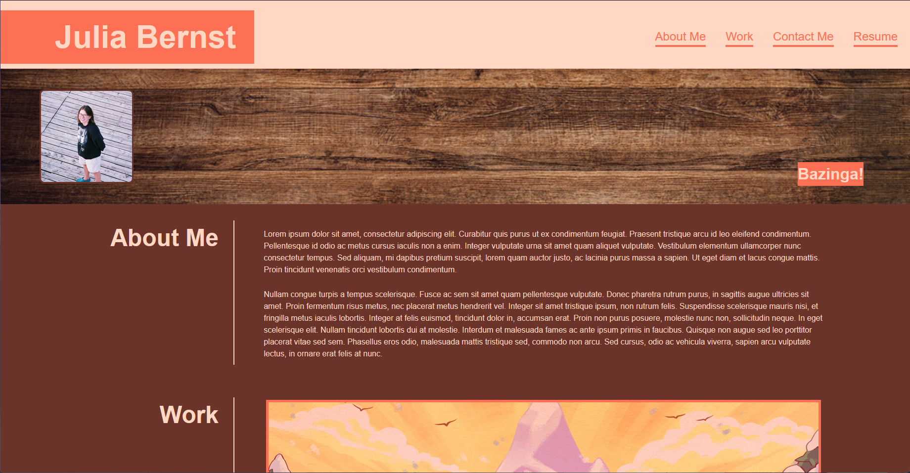

# <Challenge-2>

## Description

A portfolio page displaying my photo, contact information, and applications that I have made. A portfolio is important for people, including potential employers, to view my recent work. This website displays all relevant information in a clean and aesthetically pleasing manner. Building the site helped me to better understand the box model and flexbox functions.

## Usage

## Credits

Hero image courtesy of Adobe Stock

Main image is by Amora Bettany, found at https://amorabettany.com/Celeste

Second image is from Shadow the Hedgehog (2005)

Third, Fourth, and Fifth images are from www.tumblr.com/puppibrain

## License

The last section of a high-quality README file is the license. This lets other developers know what they can and cannot do with your project. If you need help choosing a license, refer to [https://choosealicense.com/](https://choosealicense.com/).

